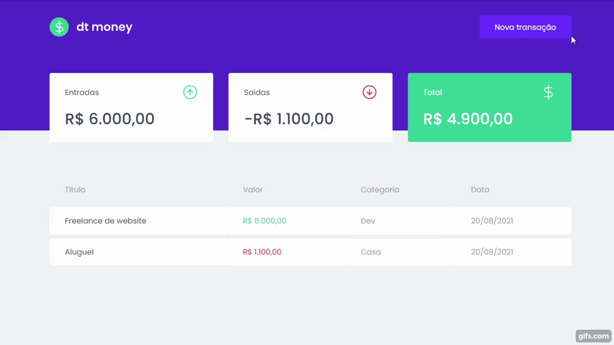

# Ignite Chapter II

  

  

## Projeto: DT Money

Capitulo 2 do ignite foi voltado para uso, de requisições de API, usamos o axios, para a criação da FakeApi usamos o **Miragejs**, uma ótima opção.

Criamos toda estrutura *HTML, CSS* e logo após fomos para as lógicas, primeiro fizemos as lógicas em cada componente, porém a aplicação pede algo mais robusto, onde um filho precisa ler o outro filho, por isso então usamos o **ContextApi** do **React**, um hook que permite você recuperar o estado independente do componente e sua hierarquia.

Bem por final criamos um **CustomHook**, para facilitar toda a importação do **useContext** que criamos. 

## Tecnologias

 - React 
 - Typescript 
 - Styled-Components 
 - axios 
 - MirageJs 
 - Polished
 - React-Modal

### Para a instalação 
Copie o repositório com o git clone #url;
Apos isso execute **yarn** para instalação das dependências;
E então de um **yarn start** para a aplicação rodar no seu Navegador;

### Prints da Aplicação
Todo o layout foi feito pela @RocketSeat 

